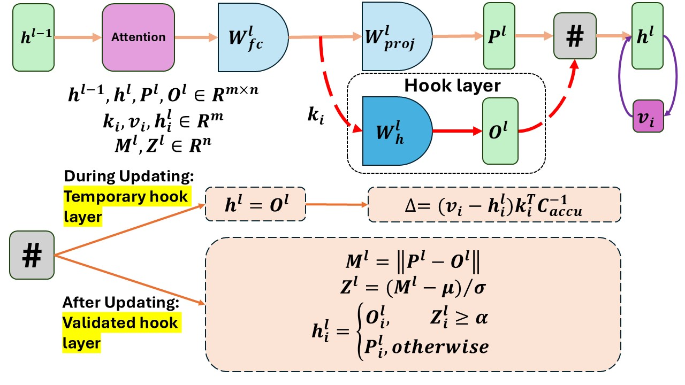
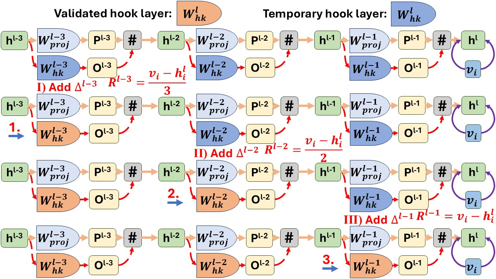

# CoachHook
Repository of the paper ["Consecutive Batch Model Editing with HooK Layers"](https://arxiv.org/abs/2403.05330)


## 🚀 Method

### Batch Editing Menchanism

$$
\begin{gather}
\Delta = RK_2^TC_{accu}^{-1}
\end{gather}
$$

where $R=(V_2-W_1K_2)$ is the residual error evaluated on the most recent updated weights. $C_{accu}=(K_0K_0^T + K'K'^T + K_2K_2^T)$ is the accumulation sum of editing keys' outer product. $K_0$ is the set of pre-training keys that have been contained in the pre-training weight, $K'=[k_{n+1}|k_{n+2}|...|k_r]$ denotes the updated keys proceeding to current editing step.


### HooK Layers & Editing scope identification
 There are two sorts of hook layers in this work, namely, the **Temporary hook layer** and the **Validated hook layer**. The temporary hook layer is temporarily applied during the weight-updating process. It replaces the original output with the output from the hook layer so that the residual is computed based on the hook layer weight. The hook layer weights are then updated using the calculated residual and the accumulated sum of the keys' outer product. Validated hook layers inherit the updated weights from the temporary hook layer, and are employed after each single-batch weight updating process at the layer.


Operations conducted in the validated hook layer (Fig. 1):

$$
\begin{gather}
P^l=W_{0}\hat{K}\quad O^l=W_{h}\hat{K} \\ 
M^l=\parallel(O^l-P^l)\parallel 
\end{gather}
$$

Note that $\parallel . \parallel$ here means computing the L2-norm for each vector over the keys' dimension ($m$). Then, we standardize $M^l$ to get the z-score vector $Z^l$ and select the swap location by comparing it with $\alpha$.

$$
\begin{equation}
h_i^l=
    \begin{cases}
        O_i^l& \text{if  $Z_i^l \geq \alpha$},\\
        P_i^l& \text{ortherwise}.
    \end{cases}
\end{equation}
$$


### Single layer update
<!-- <figure>
    
    <figcaption>Figure 1: Single layer update with hook layer (residual connections are omitted)</figcaption>
</figure> -->


**Figure 1: Single layer update with hook layer (residual connections are omitted)**

$\parallel . \parallel$ means calculate the L2-norm over the keys' dimension ($m$). For each updating of a single batch edits, the temporary hook layer is used at the beginning to ensure $\Delta$ is computed based on $W_{h}^l$. After the weights update, the validated hook layer is applied to determine whether to use the original layer or hook layer for each token. This process can be implemented iteratively to support consecutive batch editing. Note that the temporary hook layer weight of a new iteration is copied from the validated hook layer weight of the previous iteration. So, the validated hook layer keeps track of the updated layer from previous edits by retaining the weight from the previous iteration.


### Multiple layer update
<!-- <figure>
    
    <figcaption>Figure 2: Multiple layer update with hook layer (Attention module and the first layer of FFN are omitted)</figcaption>
</figure> -->


**Figure 2: Multiple layer update with hook layer (Attention module and the first layer of FFN are omitted)**

The value vector $v_i$ is first computed at the last editing layer, and then we iteratively insert a fraction of the residual to each editing layer (I, II, III). Since changing one layer would affect the activations of downstream layers, recollection of the activations is conducted after each iteration. At the beginning, temporary hook layers are initialized to all editing layers. Once the hook layer weight is updated, it is replaced by the validated hook layer (1, 2, 3).


## ✅ Implementation

### Environments & Tools

The implementation of this method was built on [EasyEdit](https://github.com/zjunlp/EasyEdit/tree/main), a nicely constructed Library for model editing.

**Pip installation**
```
git clone https://github.com/zjunlp/EasyEdit.git
conda create -n EasyEdit python=3.9.7
...
pip install -r requirements.txt
```

### Data

Our experiments used ZsRE and COUNTERFACT datasets, which can be found in [here](https://drive.google.com/file/d/1WRo2SqqgNtZF11Vq0sF5nL_-bHi18Wi4/view).

### Script Arguments

- '--stats_dir', type=str, default="./data/stats", the path of stat file
- '--model', type=str, choices=["EleutherAI/gpt-j-6B","gpt2-xl"], default="gpt2-xl", the model to use
- "--ds_dir", type=str, choices=["./editing-data/data/zsre/zsre_mend_eval.json", "./editing-data/data/counterfact/counterfact-edit.json"], default="./editing-data/data/zsre/zsre_mend_eval.json", the dataset directory
- '--consecutive', type=bool, default=False, whether the editing happens in a consecutive way
- '--bsz', type=int, default=30, the editing batch size to use
- '--mom2_update_weight', type=int, default=15000, the moment2 update weight
- '--alpha_z', type=float, default=2.2, the initial alpha
- '--num_layers', type=int, choices=range(1,8), default=8, the number of layers in the critical path to use
- '--sample', type=int, default=100, number of samples to use
- '--wohk', type=bool, default=False, whether to use the hook layer


To run the script, change the TRANSFORMERS_CACHE and HF_DATASETS_CACHE in the bash file to your corresponding directory and execute:
`sh run.sh`

It may take relatively longer time (around 20 hours for GPT-J) for the first run, as the method needs to compute the layer covariance matrix. However, after it has been cached, the run would be much more faster.


## ⭐ Citation


If you find our work useful, please cite our paper.
```
@article{DBLP:journals/corr/abs-2403-05330,
  author       = {Shuaiyi Li and
                  Yang Deng and
                  Deng Cai and
                  Hongyuan Lu and
                  Liang Chen and
                  Wai Lam},
  title        = {Consecutive Model Editing with Batch alongside HooK Layers},
  journal      = {CoRR},
  volume       = {abs/2403.05330},
  year         = {2024},
  url          = {https://doi.org/10.48550/arXiv.2403.05330},
  doi          = {10.48550/ARXIV.2403.05330},
  eprinttype    = {arXiv},
  eprint       = {2403.05330},
  timestamp    = {Sun, 06 Oct 2024 21:24:51 +0200},
  biburl       = {https://dblp.org/rec/journals/corr/abs-2403-05330.bib},
  bibsource    = {dblp computer science bibliography, https://dblp.org}
}
```
